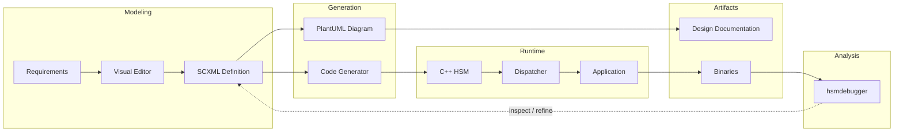

[](https://github.com/igor-krechetov/hsmcpp/blob/main/LICENSE)
[](https://github.com/igor-krechetov/hsmcpp/blob/main/CHANGELOG.md)
[](https://hsmcpp.readthedocs.io/en/latest/?badge=latest)

# Releases
[](https://github.com/igor-krechetov/hsmcpp/tags)
[](https://registry.platformio.org/libraries/igor-krechetov/hsmcpp)
[](https://www.ardu-badge.com/hsmcpp)


# hsmcpp — Hierarchical State Machines for Embedded & Event-Driven C++
A C++ library for building scalable, maintainable hierarchical state machines for embedded and event-driven systems.

* Embedded-ready (Linux, QNX, FreeRTOS, Arduino)
* SCXML-based code generation + visual tooling
* Thread-safe, async/sync execution  
* MISRA C++ checks enforced in CI

Eliminate fragile switch-case FSMs and replace them with scalable, testable state machines that work across embedded and multi-threaded systems.

## Why hsmcpp for embedded systems?
- Manage complex state logic without spaghetti code
- Model behavior visually with SCXML and keep it in sync with implementation
- Debug transitions and state flow with built-in tooling
- Designed for high-performance and real-time workflows
- Integrate easily with your runtime (RTOS, Qt, STD, etc.)

## Is this library a good fit for your project?
**Good fit for:**
- C++ engineers building event-driven and embedded systems
- Teams needing maintainable state logic at scale and architecture-as-code

**May be overkill for:**
- trivial FSMs
- ultra-constrained environments with no dynamic memory

# Quick Start

hsmcpp supports two workflows:
- **Model-driven (recommended): SCXML + code generation + visual tooling**
- Code-first: define state machines directly in C++

## Visual Workflow (SCXML-based)


## Minimal code-only example

```C++
#include <chrono>
#include <thread>
#include <memory>
#include <hsmcpp/hsm.hpp>
#include <hsmcpp/HsmEventDispatcherSTD.hpp>

enum class States { OFF, ON };
enum class Events { SWITCH };

int main(const int argc, const char**argv)
{
    std::shared_ptr<hsmcpp::HsmEventDispatcherSTD> dispatcher = hsmcpp::HsmEventDispatcherSTD::create();
    hsmcpp::HierarchicalStateMachine<States, Events> hsm(States::OFF);

    // Register states
    hsm.registerState(States::OFF, [&hsm](const VariantList_t& args) {
        std::this_thread::sleep_for(std::chrono::milliseconds(1000));
        hsm.transition(Events::SWITCH);
    });
    hsm.registerState(States::ON, [&hsm](const VariantList_t& args) {
        std::this_thread::sleep_for(std::chrono::milliseconds(1000));
        hsm.transition(Events::SWITCH);
    });

    // Register transitions
    hsm.registerTransition(States::OFF, States::ON, Events::SWITCH);
    hsm.registerTransition(States::ON, States::OFF, Events::SWITCH);

    // Initialize HSM
    hsm.initialize(dispatcher);

    // Start dispatcher and block
    dispatcher->join();

    return 0;
}
```
For complete code see [examples/00_helloworld/00_helloworld_std.cpp](https://github.com/igor-krechetov/hsmcpp/blob/codex/test-and-fix-conan-build-for-examples/examples/00_helloworld/00_helloworld_std.cpp).

## Minimal SCXML-based example

`blink.scxml`:
```xml
<scxml xmlns="http://www.w3.org/2005/07/scxml" version="1.0" initial="OFF">
  <state id="OFF">
    <invoke srcexpr="onOff"/>
    <transition event="SWITCH" target="ON"/>
  </state>

  <state id="ON">
    <invoke srcexpr="onOn"/>
    <transition event="SWITCH" target="OFF"/>
  </state>
</scxml>
```

Minimal C++ code to use the generated `BlinkHsmBase`:

```C++
#include "gen/BlinkHsmBase.hpp"

class BlinkHsm : public BlinkHsmBase {
protected:
    void onOff(const hsmcpp::VariantVector_t&) override {
        transition(BlinkHsmEvents::SWITCH);
    }

    void onOn(const hsmcpp::VariantVector_t&) override {
        transition(BlinkHsmEvents::SWITCH);
    }
};

int main(const int argc, const char** argv) {
    std::shared_ptr<HsmEventDispatcherSTD> dispatcher = HsmEventDispatcherSTD::create();
    BlinkHsm hsm;

    if (true == hsm.initialize(dispatcher)) {
        dispatcher->join();
    }

    return 0;
}
```

For complete workflows and editor integration, see [Code generation docs](https://hsmcpp.readthedocs.io/en/latest/code-generation/code-generation.html) and [/examples/02_generated](https://github.com/igor-krechetov/hsmcpp/tree/main/examples/02_generated).

## Get Started in 60 Seconds

```bash
git clone https://github.com/igor-krechetov/hsmcpp.git
cd ./hsmcpp
mkdir ./build
cd ./build
cmake ..
make -j4
# run example
./examples/00_helloworld/00_helloworld_std
```
Explore more examples in [/examples](https://github.com/igor-krechetov/hsmcpp/tree/main/examples).


# Key Features

## Platform support matrix

| Platform | Support | Dispatchers | Notes |
| --- | --- | --- | --- |
| Linux | ✅ | STD, GLib, GLibmm, Qt |  |
| QNX | ✅ | STD | Custom dispatcher planned |
| Arduino | ✅ | Arduino |  |
| FreeRTOS | ✅ | FreeRTOS | V10.3.1+ |
| Windows | ✅ | STD, Qt |  |

## Generic
- visual state machine editors (through [thirdparty editors](https://hsmcpp.readthedocs.io/en/latest/code-generation/editors/editors.html))
- [code generation](https://hsmcpp.readthedocs.io/en/latest/code-generation/code-generation.html) based on [W3C SCXML format](https://www.w3.org/TR/scxml/)
- PlantUML diagrams generation (from SCXML files)
- asynchronous / synchronous execution
- thread safety
- [configurable event dispatchers](https://hsmcpp.readthedocs.io/en/latest/platforms/platforms.html#built-in-dispatchers)
- [visual debugger](https://hsmcpp.readthedocs.io/en/latest/tools/hsmdebugger/hsmdebugger.html) to help analyze state machine behavior

## State machine related
- [states](https://hsmcpp.readthedocs.io/en/latest/features/states/states.html)
- [substates](https://hsmcpp.readthedocs.io/en/latest/features/substates/substates.html) (possible to define hierarchy)
- [transitions](https://hsmcpp.readthedocs.io/en/latest/features/transitions/transitions.html)
- [history](https://hsmcpp.readthedocs.io/en/latest/features/history/history.html)
- [timers](https://hsmcpp.readthedocs.io/en/latest/features/timers/timers.html)
- state and transition [callbacks](https://hsmcpp.readthedocs.io/en/latest/code-generation/scxml/scxml.html#callbacks-definition) (enter, exit, state changed, on transition)
- passing data to state and transition callbacks
- [parallel states](https://hsmcpp.readthedocs.io/en/latest/features/parallel/parallel.html)
- [final states](https://hsmcpp.readthedocs.io/en/latest/features/substates/substates.html#final-state)
- [conditional transitions](https://hsmcpp.readthedocs.io/en/latest/features/transitions/transitions.html#conditional-transitions)
- [conditional entry points](https://hsmcpp.readthedocs.io/en/latest/features/substates/substates.html#conditional-entry-points)
- [state actions](https://hsmcpp.readthedocs.io/en/latest/features/states/states.html#state-actions)
- [self transitions](https://hsmcpp.readthedocs.io/en/latest/features/transitions/transitions.html#self-transitions)
- transition cancelation
- support for std::function and lambdas as callbacks


# Installation

## Building from source
```bash
git clone https://github.com/igor-krechetov/hsmcpp.git
cd ./hsmcpp
./srcipts/build.sh
cd ./build
make install
```

By default, this builds core library components, tests, and examples. You can disable unneeded components with CMake options. See [Getting started](https://hsmcpp.readthedocs.io/en/latest/getting-started/getting-started.html#building-the-library) page for details and more options.

## Supported package managers
| Package manager | Status |
| --- | --- |
| [PlatformIO](https://registry.platformio.org/libraries/igor-krechetov/hsmcpp) | ✅ |
| [Arduino library registry](https://www.ardu-badge.com/hsmcpp) | ✅ |
| [Conan](https://conan.io) | TODO |
| Ubuntu (TBD) | TODO |

## Dependencies
- For library:
  - C++11 or newer
  - glib (optional, for dispatcher)
  - glibmm (optional, for dispatcher)
  - Qt (optional, for dispatcher)
- For build:
  - cmake 3.16+
  - Visual Studio 2015+ (for Windows build)
- For code generator:
  - Python 3
- For hsmdebugger:
  - Python 3
  - PyYaml (pip3 install PyYaml)
  - PySide6 (pip3 install PySide6)
  - plantuml (minimal version: V1.2020.11)

# Documentation
Documentation is available at [hsmcpp.readthedocs.io](https://hsmcpp.readthedocs.io).

- [Getting Started](https://hsmcpp.readthedocs.io/en/latest/getting-started/getting-started.html)
- [SCXML workflows](https://hsmcpp.readthedocs.io/en/latest/code-generation/editors/editors.html)
- [Platform integration](https://hsmcpp.readthedocs.io/en/latest/platforms/platforms.html)
- [API reference](https://hsmcpp.readthedocs.io/en/latest/api/api.html)


# Tooling

## hsmdebugger
[Read documentation](https://hsmcpp.readthedocs.io/en/latest/tools/hsmdebugger/hsmdebugger.html) for details on how to use debugger.


## SCXML GUI Editors
Check out [documentation](https://hsmcpp.readthedocs.io/en/latest/code-generation/editors/editors.html) to learn more about available editors.

> **Note:** the dedicated editor [hsm-ide](https://github.com/igor-krechetov/hsm-ide/) is under active development and will be available soon.


# Why should you use Statecharts?

Statecharts offer a surprising array of benefits

- It's [easier to understand a statechart](https://statecharts.dev/benefit-easy-to-understand.html) than many other forms of code.
- The [behaviour is decoupled](https://statecharts.dev/benefit-decoupled-behaviour-component.html) from the component in question.
  - This makes it [easier to make changes to the behaviour](https://statecharts.dev/benefit-make-changes-to-the-behaviour.html).
  - It also makes it [easier to reason about the code](https://statecharts.dev/benefit-reason-about-code.html).
  - And the behaviour can be [tested independently](https://statecharts.dev/benefit-testable-behaviour.html) of the component.
- The process of building a statechart causes [all the states to be explored](https://statecharts.dev/benefit-all-states-explored.html).
- Studies have shown that statechart based code has [lower bug counts](https://statecharts.dev/benefit-low-bug-count.html) than traditional code.
- Statecharts lends itself to dealing with [exceptional situations](https://statecharts.dev/benefit-handle-anomalies.html) that might otherwise be overlooked.
- As complexity grows, statecharts [scale well](https://statecharts.dev/benefit-scales-with-complexity.html).
- A statechart is a great communicator: Non-developers can [understand the statecharts](https://statecharts.dev/benefit-non-developers-understanding.html), while QA can [use a statecharts as an exploratory tool](https://statecharts.dev/benefit-qa-exploration-tool.html).

It's worth noting that you're [already coding state machines](https://statecharts.dev/benefit-explicit.html), except that they're hidden in the code.

## Why should you not use statecharts?

There are a few downsides to using statecharts that you should be aware of.

- Programmers typically [need to learn something new](https://statecharts.dev/drawback-learn-new-technique.html), although the underpinnings (state machines) would be something that most programmers are familiar with.
- [It's usually a very foreign way of coding](https://statecharts.dev/drawback-foreign-paradigm.html), so teams might experience pushback based on how very different it is.
- There is an overhead to extracting the behaviour in that the [number of lines of code might increase](https://statecharts.dev/drawback-lines-of-code.html) with smaller statecharts.

## Why are they not used?

- [People don't know about them, and YAGNI](https://statecharts.dev/faq/why-statecharts-are-not-used.html).

## What are the main arguments against statecharts?

There are a few common arguments against statecharts in addition to the ones listed above:

- It's [simply not needed](https://statecharts.dev/faq/an-event-always-has-one-action.html).
- It [goes against the grain](https://statecharts.dev/faq/goes-against-grain.html) of _\[insert name of technology]_.
- It [increases the number of libraries](https://statecharts.dev/faq/increases-number-of-libraries.html), for web applications this means increased load time.

The benefits outlined above should make it clear that the introduction of statecharts is generally a _net positive_.


# Notable alternatives
There is no one-for-all library, so if hsmcpp doesn't fully suit your needs you can check out one of these alternatives:
- [Qt](https://github.com/qt/qtscxml) (using QStateMachine or QScxmlStateMachine)
- [QP/C++](https://github.com/QuantumLeaps/qpcpp)
- [TinyFSM](https://github.com/digint/tinyfsm)
- [Another Finite State Machine](https://github.com/zmij/afsm)
- [HFSM2](https://github.com/andrew-gresyk/HFSM2)
- [arduino-fsm](https://github.com/jonblack/arduino-fsm)


# Quality Status

[](https://github.com/igor-krechetov/hsmcpp/actions/workflows/ci_pipeline.yml)

## Static Code Analysis

[](https://scan.coverity.com/projects/igor-krechetov-hsmcpp)


## Unit Tests

[](https://coveralls.io/github/igor-krechetov/hsmcpp?branch=main)

[](https://igor-krechetov.github.io/hsmcpp/badges/tests_result_std.log)
[](https://igor-krechetov.github.io/hsmcpp/badges/tests_result_glib.log)
[](https://igor-krechetov.github.io/hsmcpp/badges/tests_result_glibmm.log)
[](https://igor-krechetov.github.io/hsmcpp/badges/tests_result_qt.log)